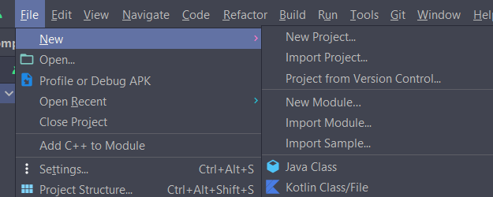
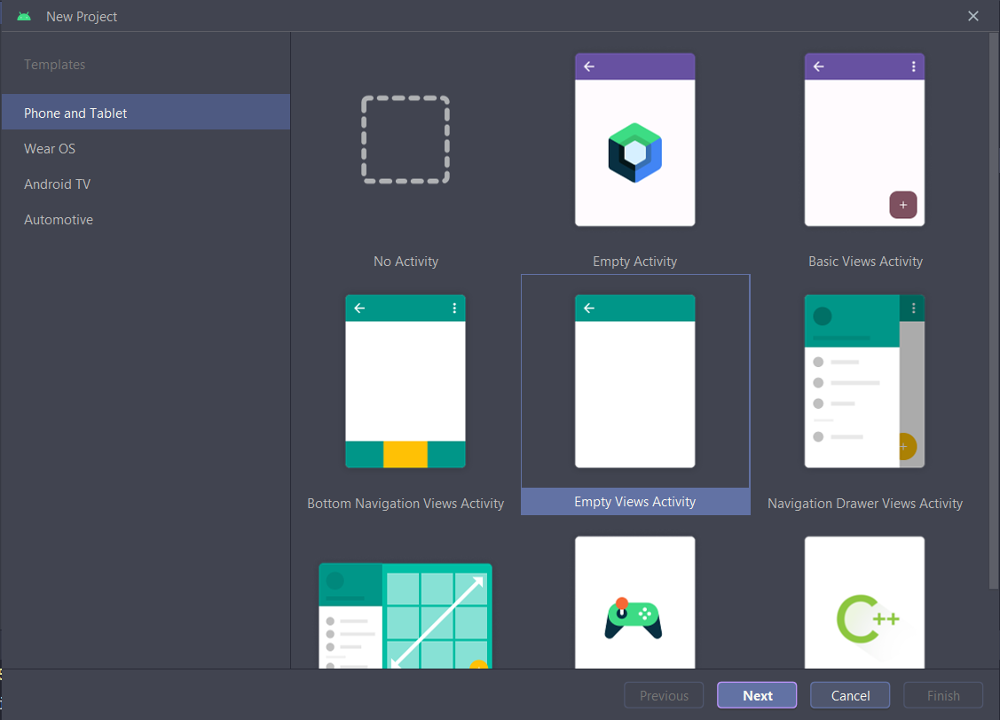
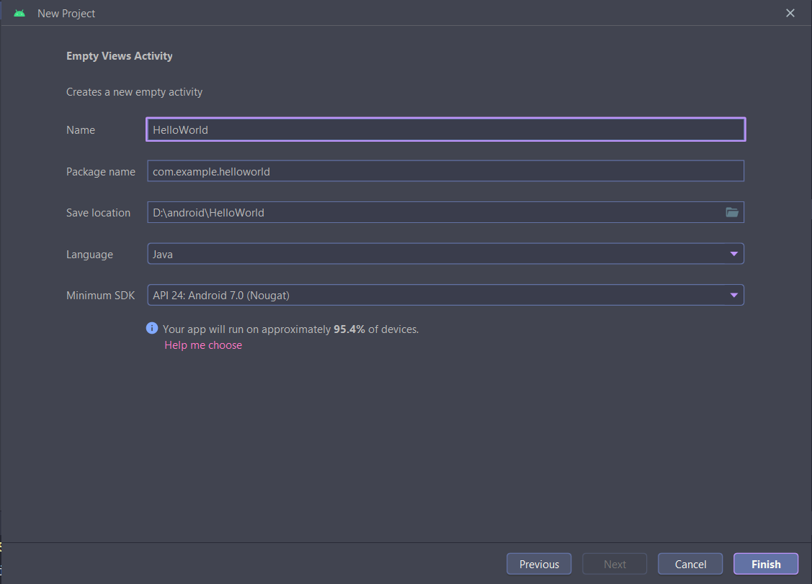
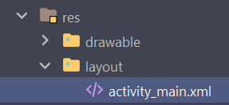
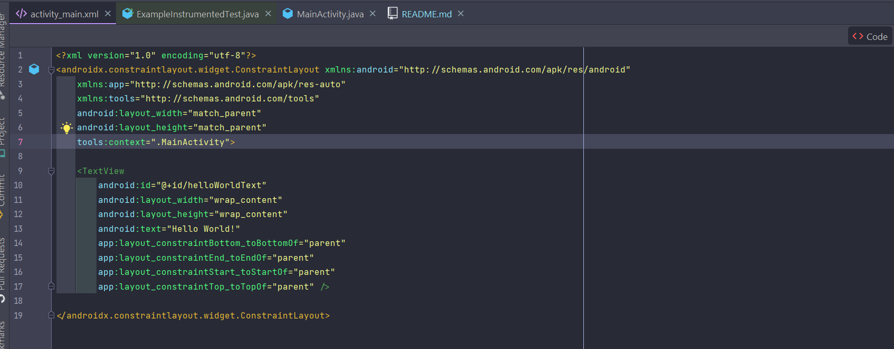
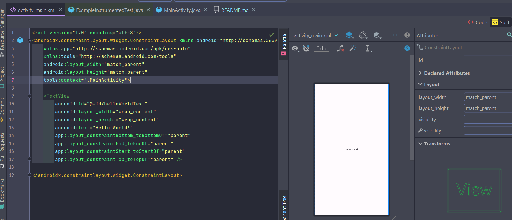
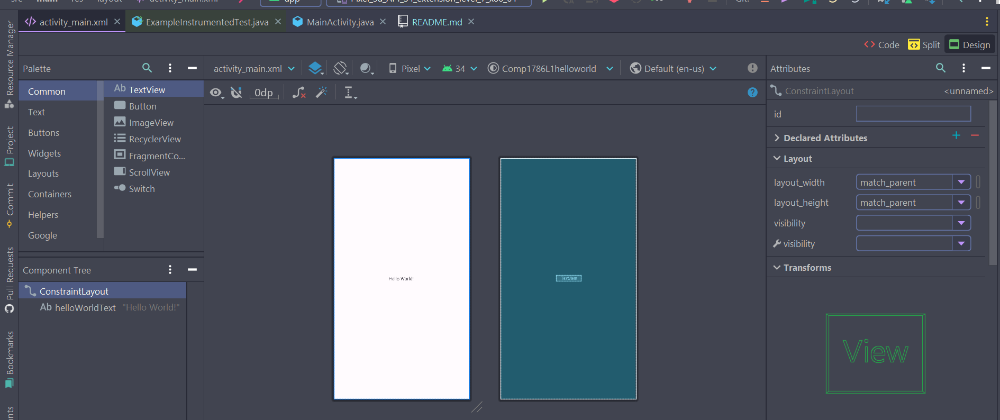
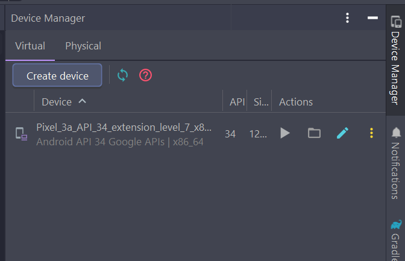
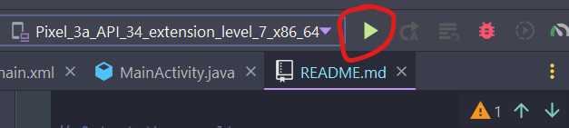
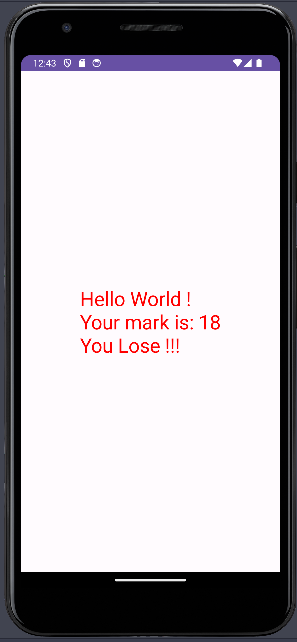

# HOW TO CREATE ANDROID PROJECT

### Create a project: File > New > New Project



### Choose the kind of activity: Choose "New Views Activity"



### Project Setting: Set *Name*, *Language* to `Java`, *Minimum

SDK* to `API 24: Android 7.0 (Nougat)`



### Project Structure

Layout will be defined in `res` > `layout`



To create the layout, start modify code in `activity_main.xml`

```xml
<?xml version="1.0" encoding="utf-8"?>
<androidx.constraintlayout.widget.ConstraintLayout
    xmlns:android="http://schemas.android.com/apk/res/android"
    xmlns:app="http://schemas.android.com/apk/res-auto"
    xmlns:tools="http://schemas.android.com/tools" android:layout_width="match_parent"
    android:layout_height="match_parent" tools:context=".MainActivity">

    <TextView android:id="@+id/helloWorldText" android:layout_width="wrap_content"
        android:layout_height="wrap_content" android:text="Hello World!"
        app:layout_constraintBottom_toBottomOf="parent" app:layout_constraintEnd_toEndOf="parent"
        app:layout_constraintStart_toStartOf="parent" app:layout_constraintTop_toTopOf="parent" />

</androidx.constraintlayout.widget.ConstraintLayout>

```

The layout can be set to 3 options

`Code Only`



`Spilt`



`Design Only`



### Java Code: Include the following code in `MainActivity.java` to create the first Android App

```java
public class MainActivity extends AppCompatActivity {

    @Override
    protected void onCreate(Bundle savedInstanceState) {
        super.onCreate(savedInstanceState);
        setContentView(R.layout.activity_main);

        // Get a reference to the GUI
        TextView helloWorld = (TextView) findViewById(R.id.helloWorldText);

        // Generate a random number from 0 - 100
        int mark = 0;
        Random r = new Random();
        mark = r.nextInt(100);
        mark++;

        // Output the result
        helloWorld.setTextSize(30);
        helloWorld.setTextColor(Color.BLUE);
        helloWorld.setText("Hello World !\n");
        helloWorld.append("Your mark is: " + mark);

        // If-else statement
        if (mark < 50) {
            helloWorld.setTextColor(Color.RED);
            helloWorld.append("\nYou Lose !!!");
            return;
        }
        helloWorld.setTextColor(Color.GREEN);
        helloWorld.append("\nYou Win !!!");

    }
}
```

To launch the virtual device, go to `Device Manager` then `Create device`



After that, compile and start the application.



Voila, the first Android app has been created


