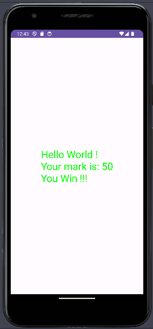

# HOW TO CREATE ANDROID PROJECT

### Step 1: File > New > New Project


### Step 2: Choose "New Views Activity"


### Step 3: Set *Name*, *Language* to `Java`, *Minimum SDK* to `API 24: Android 7.0 (Nougat)`


### Step 4: Include the following code to create the first Android App

```java
public class MainActivity extends AppCompatActivity {

    @Override
    protected void onCreate(Bundle savedInstanceState) {
        super.onCreate(savedInstanceState);
        setContentView(R.layout.activity_main);

        // Get a reference to the GUI
        TextView helloWorld = (TextView) findViewById(R.id.helloWorldText);

        // Generate a random number from 0 - 100
        int mark = 0;
        Random r = new Random();
        mark = r.nextInt(100);
        mark++;

        // Output the result
        helloWorld.setTextSize(30);
        helloWorld.setTextColor(Color.BLUE);
        helloWorld.setText("Hello World !\n");
        helloWorld.append("Your mark is: " + mark);

        // If-else statement
        if (mark < 50) {
            helloWorld.setTextColor(Color.RED);
            helloWorld.append("\nYou Lose !!!");
            return;
        }
        helloWorld.setTextColor(Color.GREEN);
        helloWorld.append("\nYou Win !!!");

    }
}
```

Voila, the first Android app has been created



