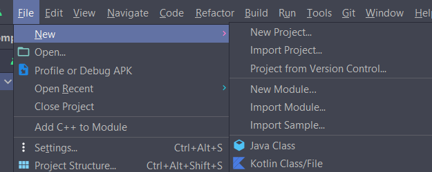
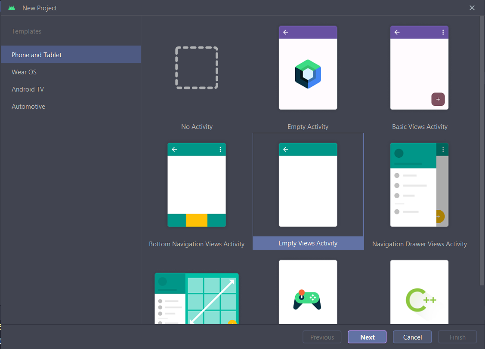
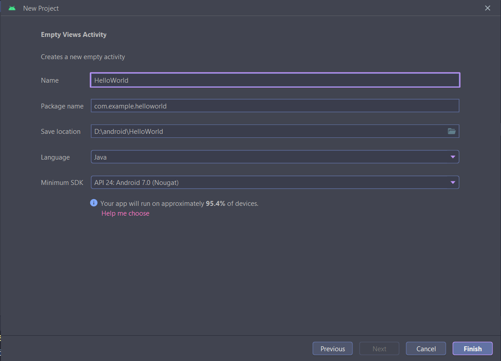

# HOW TO CREATE ANDROID PROJECT

### Step 1: File > New > New Project

### Step 2: Choose "New Views Activity"

### Step 3: Set *Name*, *Language* to `Java`, *Minimum SDK* to `API 24: Android 7.0 (Nougat)`

